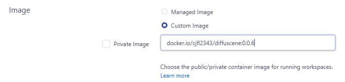
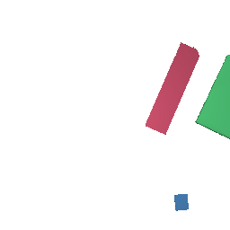
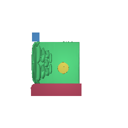

> [!NOTE] 
> This README was created with AI help to give you clear setup and usage instructions for DiffuScene. 
>
> This repository is based on the original code at https://github.com/tangjiapeng/DiffuScene and the paper https://arxiv.org/abs/2303.14207.
>
> The original README file has been renamed to [_README.md](_README.md).

<br>

## Installation

### For Vessl
To set up the DiffuScene environment in Vessl, set the Custom Image to `docker.io/cjfl2343/diffuscene:0.0.7`. This image was made for this project and has all the required packages already installed. The Docker image comes from the [`Dockerfile.diffuscene`](Dockerfile.diffuscene) file in this repository.
**Since this image uses CUDA 11.6, it is recommended to use a node with CUDA version 11.x or higher** (e.g., `eve-s05`, `character-s05`).


<div align="center" >
    
    <br><br>
    <i>Set Custom Image to </i> <code>docker.io/cjfl2343/diffuscene:0.0.7</code>
</div>

<br>

### Cloning Repository

To get started with DiffuScene, first clone this repository:
This will create a folder named `KOCCA-SceneRearrange` with all necessary source code and scripts.

```bash
git clone https://github.com/KAIST-VML/KOCCA-SceneRearrange.git
cd KOCCA-SceneRearrange
```

<br>


## Set Up Preprocessed Data & Pretrained Models

To set up the prepared data and pre-trained models, run these scripts in order:

1. Install extra Python packages and Chamfer Distance:

   ```
   bash setup_a.sh
   ```

<br>

2. Download all required zip files (preprocessed datasets and pretrained models). **If download fails, follow the provided message to manually download and place the zip file in the project root**:

   ```
   bash setup_b.sh
   ```

<br>

3. Unzip and organize the files into the proper directories. **Before running this step, ensure that the following zip files** (`3d_front_processed.zip`, `3D-FUTURE-model-processed.zip`, `objautoencoder_pretrained.zip`, `pretrained_diffusion.zip`) are present in the root directory.

   ```
   bash setup_c.sh
   ```

<br>


## Rearranged Scene Generation

The `generate_rearrange.sh` script creates rearranged scenes using pretrained diffusion models. It works on both bedrooms and living rooms from the training and validation parts of the 3D-FRONT dataset.

To generate rearranged scenes, run:

```bash
bash run/generate_rearrange.sh
```

The script does the following:
- Creates rearranged scenes for bedrooms using the pretrained model checkpoint `model_17000`
- Creates rearranged scenes for living rooms using the pretrained model checkpoint `model_81000`

<br>

For each room type, the script generates:
- Top-down orthographic renderings of the synthesized scenes (without texture and floor)
- 3D mesh files of the generated scenes
- Ground-truth images for comparison

<div align="center" display="flex">
    
    
    
    <br>
    <i>From the left, noisy scene · rearranged scene · groundtruth scene</i>
</div>

<br>

Outputs are saved to `./cluster/balrog/jtang/rearrange_with_train_val_data/{ROOM_TYPE}_rearrange/gen_top2down_notexture_nofloor/`.


<br>

## FID Computation

Before computing FID, make sure you have synthesized scenes created by the pretrained rearrangement models.
You can then compute FID scores between the ground-truth and synthesized scenes.

<br>

### FID with Global Rotation Matching

Since the difference between the generated results and the ground-truth is often just a global rotation, I added a global rotation matching option for FID computation.

For each pair of ground-truth and synthesized scenes, the FID computation script compares the ground-truth scene to all four possible global rotations (0°, 90°, 180°, 270°) of the synthesized scene, and then selects the rotation with the minimum distance between the synthesized and ground-truth scenes:

<div align="center" display="flex">
    
    
    
    
    <br>
    <i>The one with the minimum distance between the synthesized and ground-truth <br> is selected from among the four rotations</i>
</div>

<br>

You can compute the FID with global rotation matching using the shell script below:
```bash
bash run/compute_fid_scores_with_global_rotation.sh
```

<br>

### FID without Global Rotation Matching

The standard FID computation compares ground-truth and generated scenes directly without any rotation matching. This gives you a baseline score. You can compute the FID without global rotation matching using the script below:

```bash
bash run/compute_fid_scores_without_global_rotation.sh
```

<br>

### Feature Extractor

The `compute_fid_scores.py` script supports two feature extractors:

- `clip`: Uses CLIP ViT-B/32, a vision-language model that captures semantic and visual features
- `inception`: Uses Inception V3, a deep convolutional network trained on ImageNet

Both shell scripts (`compute_fid_scores_with_global_rotation.sh` and `compute_fid_scores_without_global_rotation.sh`) automatically compute FID scores. The feature extractor can be specified using the `--feature_extractor` argument when running the script directly.


<br>

## Note
The paper evaluates scene generation quality in three categories (bedrooms, living rooms, and dining rooms), but the provided pretrained models do not include a model for dining rooms. I asked how I can obtain the model checkpoint (https://github.com/tangjiapeng/DiffuScene/issues/64).